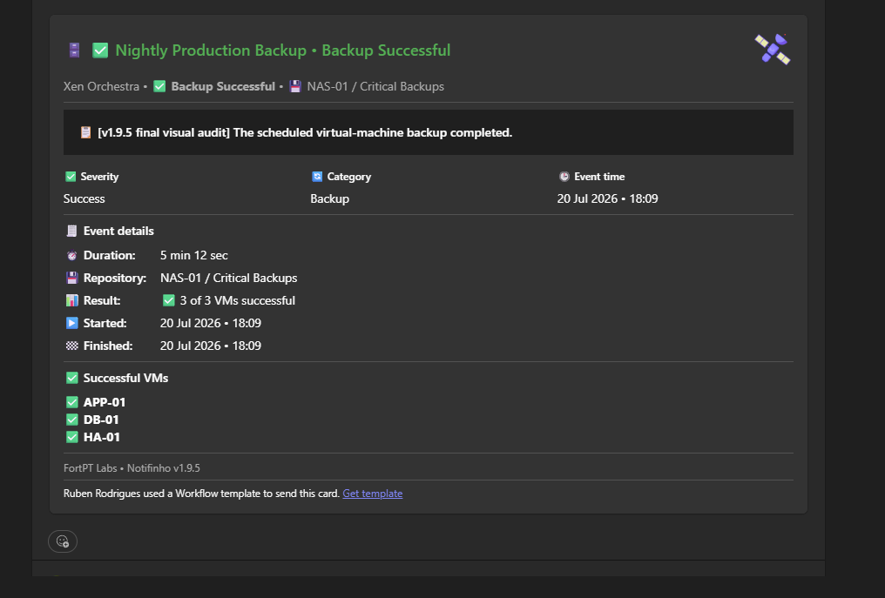
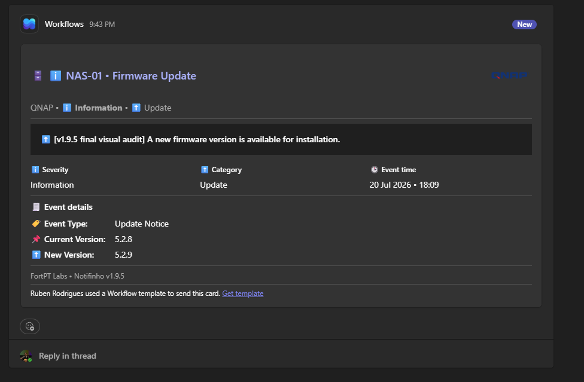
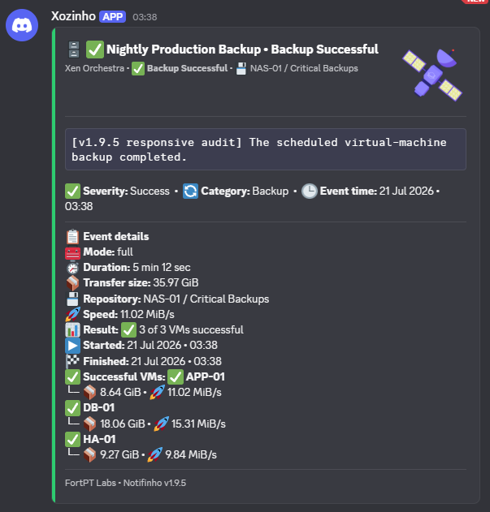
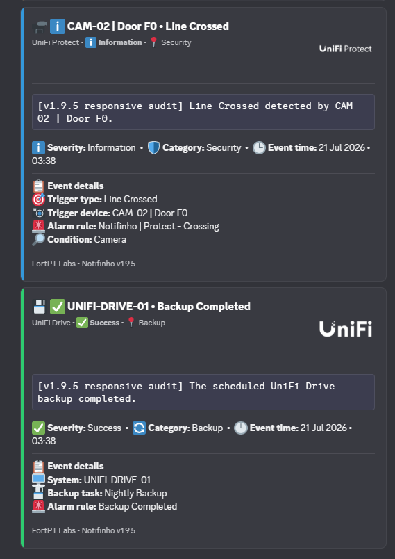

<p align="center">
  
</p>

<h1 align="center">Notifinho</h1>

<p align="center">
  <strong>Infrastructure Notification Engine</strong>
</p>

<p align="center">
Built for Homelabs • Ready for Enterprise
</p>

<p align="center">

<a href="https://github.com/FortPT/notifinho/releases">
  
</a>

<a href="https://www.python.org/">
  
</a>


</p>

---

# 🚀 Project Status

| Property | Value |
|----------|-------|
| **Status** | 🚀 Stable – Production Ready |
| **Current Stable Release** | **v2.5.0** |
| **Next Planned Release** | **v2.x** |
| **License** | MIT |
| **Python** | 3.13 |

Notifinho is stable and production ready. New parsers, notification platforms
and integrations remain planned with backwards compatibility as a priority.

See the [v2.5.0 release notes](docs/releases/v2.5.0.md) for the database-authoritative resource migration and normalized core configuration. The complete operator walkthrough is in the [v2.5.0 acceptance checklist](docs/v2.5.0-acceptance-checklist.md).

Notifinho v2 adds a self-hosted notification platform with local accounts,
database-authoritative destinations, routes, application tokens, regional
preferences, backup schedules, integration behavior and aliases. Each resource
has its own transaction and error boundary, so one damaged destination, route,
or settings record does not prevent unrelated WebUI pages from loading.
`config.yaml` is now limited to process bootstrap, listener and security
settings. Existing v2.4 YAML resources are imported once into schema 8 and then
removed from the mounted file. First startup emits a short-lived, single-use
setup token so the operator can choose the first administrator credentials in
the browser without a default password or CLI bootstrap. Notifinho consumes
emitted SMTP or webhook notifications; it does not poll infrastructure APIs,
IMAP, Microsoft Graph, Gmail, or other
mailboxes. SMTP transport security remains disabled by default and can be
enabled with STARTTLS and SMTP AUTH; see the
[SMTP security guide](docs/smtp-security.md).

v2.2.0 adds a dismissible notice centre, lifecycle-bound error and update
notices, time-range delivery metrics, a complete routing-flow view, semantic
route ordering, application usage controls, profile pictures, operational
health checks, and scheduled state backups to a host-mounted NFS or SMB share.

v2.3.0 makes those operational workflows immediate and easier to read. It adds
first-login notice enrollment, source categories and real input transports,
animated route flow, channel-aware destination cards, semantic Delivery
History, live Audit Log updates, avatar cropping, an audited restart control,
and separate Inputs and Backups pages. Backup destinations can now be named
Local, NFS, or SMB targets with connectivity/write tests and manual or
scheduled execution; host-mounted shares remain the safest default.

v2.3.2 completes the follow-up production corrections: vendor source icons and
purpose-specific categories, safe removal of inactive sources, accurate
wildcard-route activity, destination-branded test events, a header restart
control, dual HTTP/HTTPS cookie migration, and a directly usable managed-mount
Compose profile including NFSv3 backup behavior in the read-only container.

v2.3.4 completes the final requested polish: Notifinho is slightly larger,
Dell iDRAC, UniFi Network, UniFi Protect, and QNAP are much larger, Synology is
larger, F5 reliably returns to the active page instead of Overview, inactive
source removal accepts the current browser request shape, and the 2.3.3
operations-menu, update-check, destination-test, and regional backup-clock
corrections remain in place.

---

# 📸 Preview

The examples below show the final live presentation approved on
Microsoft Teams and Discord. Both destinations use the same device/event,
status, source-time, and official-asset contract while retaining the details
best suited to each platform.

## Microsoft Teams

| Xen Orchestra backup | QNAP firmware event |
|---|---|
|  |  |

## Discord

| Xen Orchestra backup | UniFi Protect and Drive events |
|---|---|
|  |  |

---

# What is Notifinho?

**Notifinho** is a parser-driven Infrastructure Notification Engine that transforms traditional infrastructure email alerts into rich, structured notifications for modern collaboration platforms.

Instead of reading long HTML emails generated by infrastructure products, administrators receive clean, actionable notifications containing exactly the information they need, directly in Discord or Microsoft Teams.

Notifinho works alongside your existing infrastructure without requiring changes to the monitored software. If a product can send email, Notifinho can receive it, understand it, and deliver a significantly better notification experience.

Its modular architecture separates source detection, parsers, the shared
notification model, routing, formatters, and outputs, making it easy to support
additional infrastructure platforms and messaging services over time.

---

# 🇵🇹 Why the name?

**Notifinho** comes from the Portuguese word **"notificação"** (notification).

The suffix **"-inho"** is commonly used in Portuguese to express something small, concise or simplified.

The idea behind the name reflects the project's purpose:

Instead of overwhelming administrators with long HTML emails, Notifinho delivers **small, clean and meaningful notifications** that can be understood in just a few seconds.

Simple.

Readable.

Actionable.

---

## 📑 Contents

- [What is Notifinho?](#what-is-notifinho)
- [Why Notifinho?](#why-notifinho)
- [Features](#features)
- [Supported Integrations](#supported-integrations)
- [Preview](#-preview)
- [Project Goals](#project-goals)
- [Core Concepts](#core-concepts)
- [Architecture](#architecture)
- [Design Principles](#design-principles)
- [Quick Start](#quick-start)
- [Configuration](#configuration)
- [Example Flow](#example-flow)
- [Roadmap](#roadmap)
- [Contributing](#contributing)
- [License](#license)

---

# Why Notifinho?

Most infrastructure platforms still rely on HTML emails to report important events.

While these emails contain valuable information, they are often difficult to read, especially on mobile devices, and require administrators to search through large amounts of text to identify what really matters.

Notifinho solves this problem by parsing those emails and presenting the information in a clean, structured and consistent format designed for modern collaboration platforms.

Instead of replacing your monitoring software, Notifinho enhances it.

---

## Traditional Email vs. Notifinho

| Traditional Email | Notifinho |
|-------------------|------------|
| Long HTML emails | Rich notification cards |
| Difficult to read on mobile | Mobile-friendly layout |
| Important data buried in text | Critical information highlighted |
| Generic formatting | Product-specific formatting |
| Email only | Discord and Microsoft Teams |
| Limited visual feedback | Status colors, icons and structured sections |

---

# ✨ Features

## 📨 SMTP Gateway

- Native SMTP server
- Optional STARTTLS with TLS 1.2 or newer
- Optional SMTP AUTH LOGIN and PLAIN after TLS
- Environment-variable or mounted-secret credentials
- Automatic email reception
- Parser-based architecture
- Configurable routing
- Product detection based on email content
- Zero changes required to monitored software

---

## 🎨 Rich Notifications

- Beautiful Discord embeds
- Microsoft Teams Adaptive Cards
- Mobile-friendly layouts
- Severity color coding
- Structured information blocks
- Consistent formatting across integrations

---

## 🖥️ Hardware management and automation

The v1.9.0 backend adds:

- Standard Redfish Event Service envelopes with bounded batch handling and
  duplicate suppression
- Supermicro BMC/IPMI, HPE iLO, and Dell iDRAC vendor normalization
- Conservative SMTP compatibility adapters for the three hardware families
- Authenticated Home Assistant automation events
- Generic source-scoped event submission through `/api/events`
- Disabled-by-default configuration, health, logs, preview, and test-send API
  foundations
- Environment-, file-, or SHA-256-backed tokens, rate limits, masked secrets,
  private audit logs, and atomic configuration backups

See the [API](docs/api.md), [Redfish](docs/redfish.md),
[Home Assistant](docs/home-assistant.md),
[notification presentation contract](docs/presentation-contract.md), and
vendor integration guides.

---

## 💾 Xen Orchestra

Current implementation includes:

- Backup status
- Backup mode
- Start and finish times
- Duration
- Repository
- Transfer size
- Transfer speed
- Success, failure and skipped counters
- VM-level backup results
- VM transfer size
- VM transfer speed
- VM-specific failure reasons
- Optional Job ID and Run ID
- Compact operator-friendly layout

---

## 📊 Zabbix

The v1.2.0 implementation includes:

- Automatic Zabbix email detection
- Problem notifications
- Recovery notifications
- Host name
- Problem name
- Severity
- Event time
- Recovery duration
- Operational data
- Optional problem ID
- Severity-aware colors and icons
- Discord embeds
- Microsoft Teams Adaptive Cards
- Conditional host-based routing
- Secondary webhook destinations for selected hosts

---

## 💽 QNAP QTS / QuTS hero

The v1.3.0 integration, now validated with real QNAP Notification Center
delivery, includes:

- Case-insensitive QNAP Notification Center detection
- Notification Center test messages
- Failed login and security warnings
- Storage pool, volume, RAID, disk, and SMART warnings
- HBS and other backup failures
- Firmware and application update notices
- UPS and power events
- Plain-text, HTML, and multipart email parsing
- QNAP-specific Discord embeds and Microsoft Teams Adaptive Cards
- Synthetic fixtures and a local SMTP replay utility

Run the regression suite with:

```bash
python3 -m pip install -r requirements-dev.txt
python3 -m pytest -q
```

The included fixtures remain anonymized and synthetic so no production data is
stored in the repository. Real QNAP delivery has confirmed the integration;
additional QTS, QuTS hero, localized, and customized templates remain normal
compatibility-hardening work. See the [QNAP integration guide](docs/qnap.md).

---

## 📈 Grafana Alerting

The provisional v1.3.0 integration includes:

- Strong, case-insensitive Grafana email detection
- Test, firing, resolved, pending, No Data, and evaluation-error events
- Grouped notification support with alert counts
- Rule, folder, dashboard, panel, datasource, labels, values, and event times
- Grafana-specific Discord embeds and Microsoft Teams Adaptive Cards
- Dedicated Grafana webhook routing
- Synthetic plain-text, HTML, and multipart fixtures

Grafana support was developed without production email samples. The fixtures
are synthetic and do not prove compatibility with every Grafana release or
custom alert template. See the [Grafana integration guide](docs/grafana.md)
for SMTP/contact-point concepts, replay commands, and known limitations.

---

## TrueNAS 26

The provisional `v1.4.0` integration includes:

- Strong detection using sender/header identity, the `TrueNAS @ hostname`
  marker, and the upstream alert list structure
- Test, new, cleared, current, and grouped alerts
- Storage, SMART, scrub, replication, backup, UPS/power, system, network,
  security, and application/service classification
- TrueNAS-specific Discord embeds and Microsoft Teams Adaptive Cards
- Dedicated TrueNAS targets and source routing
- Synthetic plain-text, HTML, and multipart fixtures

Compatibility remains provisional for broader real-world alert variants and
customized templates. Synthetic fixtures, private test-email/test-alert
replay, and a live Send Test Alert have been validated on VM-04. See the
[TrueNAS integration guide](docs/truenas.md).

---

## ⚡ Designed for Fast Decision Making

Every notification is designed around one principle:

> **Show the right information at the right time, in the clearest possible way.**

Rather than reproducing the original email, Notifinho extracts the relevant information, removes unnecessary noise and presents the result in a format optimized for fast decision making.

---

# 🔌 Supported Integrations

Notifinho is built around two independent concepts:

- **Sources** — Products that generate SMTP email notifications.
- **Destinations** — Platforms where those notifications are delivered.

This separation allows new infrastructure products and new messaging platforms to be added independently.

## 📥 Sources

| Product | Status |
|----------|:------:|
| Xen Orchestra | ✅ Stable |
| Zabbix | ✅ v1.2.0 |
| QNAP QTS / QuTS hero | ✅ Validated |
| Grafana Alerting | 🚧 v1.3.0 |
| Generic SMTP | ↩️ Fallback |
| TrueNAS 26 | ✅ v1.8.1 real SMTP validated |
| UniFi Network / Protect / Drive | ✅ v1.7.0 |
| Proxmox VE | 🧪 v1.8.x fixture-validated; real validation pending |
| Portainer | ✅ v1.8.x validated |
| Synology DSM | ✅ v1.8.x webhook and SMTP validated |
| Generic Redfish Event Service | 🧪 v1.9.0 fixture-validated |
| Supermicro BMC / IPMI | 🧪 v1.9.0 fixture-validated |
| HPE iLO | 🧪 v1.9.0 fixture-validated |
| Dell iDRAC | 🧪 v1.9.0 fixture-validated |
| Home Assistant | 🧪 v1.9.0 contract-validated |

## 📤 Destinations

| Platform | Status |
|-----------|:------:|
| Discord | ✅ Stable |
| Microsoft Teams | ✅ Stable |
| Slack | 🧪 v2 platform API; opt-in |
| Generic outbound webhook | 🧪 v2 platform API; opt-in |
| MQTT | 🧪 v2 platform API; opt-in |
| ntfy | 🧪 v2 platform API; opt-in |

---

# 🎯 Project Goals

Notifinho was created with a few simple goals in mind:

- Modernize infrastructure notifications.
- Preserve compatibility with existing SMTP-based products.
- Minimize configuration effort.
- Present important information that can be understood in seconds.
- Keep integrations modular and easy to extend.
- Support multiple notification platforms from a single notification model.

Rather than replacing existing monitoring or backup solutions, Notifinho complements them by improving how notifications are delivered.

---

# 🧩 Core Concepts

Notifinho is built around five simple concepts.

Understanding these concepts makes it easy to understand the entire project.

| Concept | Description |
|----------|-------------|
| **Parser** | Understands the email format of a specific product. |
| **Notification Model** | Converts parsed information into a common internal structure. |
| **Router** | Selects one or more output targets, including optional source and host filters. |
| **Output** | Selects the source-specific formatter and delivers its completed payload. |
| **Formatter** | Builds a destination payload without sending web requests. |

Because these components have defined boundaries, a new source can add its own
parser and source-specific formatters without changing existing integrations,
while a new destination can be added without modifying source parsers.

---

# 🏗️ Architecture

```text
Inputs
    |- SMTP listener / raw email capture
    `- authenticated HTTP webhook listener
            |
            v
Dispatcher and source adapter
    |- email detection and source-specific parsers
    |- native UniFi JSON adapters
    |- Redfish/vendor and Home Assistant adapters
    `- generic SMTP and authenticated event fallbacks
            |
            v
Shared Notification model
            |
            v
Router
    |- source route selection
    |- output and target selection
    `- optional host filters
            |
            +-> destination formatter -> Discord output
            `-> destination formatter -> Microsoft Teams output

Backend control plane
    |- source-scoped and administrator tokens
    |- health, masked config, validation, logs, preview, and test-send
    |- atomic config updates, backups, rate limits, and audit records
    `- SQLite state, local accounts, hashed sessions/CSRF,
       scoped tokens, owned routes/destinations, secret files, and history
```

One notification model.

Multiple parsers.

Multiple outputs.

Input adapters normalize vendor-specific email or webhook formats into the
output-neutral shared `Notification` model. The router then selects one or more
configured output targets using source routes and optional host filters. Each
selected output chooses the formatter for the notification source; generic
messages use the default formatter.

Formatters only build destination payloads and never perform delivery. Outputs
deliver those completed payloads to their configured transports. Because
ingestion, normalization, routing, formatting, and delivery are separate, one
event can be delivered to multiple destinations without being parsed again.

The v1.9 backend preserves this pipeline while adding Redfish hardware events,
Home Assistant, authenticated event submission, and configuration-management
foundations. The v2.0 WebUI manages this same backend model rather than
implementing a second routing engine.

The first v2 platform phase adds an opt-in, migration-aware local state layer
without changing existing delivery behavior. See the
[platform-state and local-account guide](docs/platform-state.md).
The second phase implements the disabled service layer for
[user-scoped tokens, destinations, routes, retries, audit, and safe delivery
history](docs/platform-routing.md).
The third phase adds disabled, ownership-aware
[platform output adapters and preview/test delivery](docs/platform-outputs.md)
for Discord, Teams, Slack, generic webhooks, MQTT, and ntfy.
The fourth phase exposes those foundations through an opt-in
[authenticated platform API](docs/platform-api.md) with local sessions, CSRF,
owned-resource management, and user/application-scoped event submission.
The fifth phase packages a responsive, same-origin
[WebUI](docs/webui.md) for accounts, destinations, routes, application tokens,
preview/test delivery, delivery history, and audit events.
The sixth phase adds administrator-only, preview-first
[data portability, v1.x YAML migration, and private state backup/restore](docs/data-portability.md)
with credential-free exports, integrity manifests, rollback, and session
revocation.

---

# ⚡ Design Principles

Every design decision in Notifinho follows a few core principles.

### 📖 Readability First

Important information should be visible within seconds.

Operators should never need to read an entire HTML email to understand what happened.

---

### 🔌 Zero Changes to Existing Software

If a product can send SMTP email, it can work with Notifinho.

Existing infrastructure does not need to be modified.

---

### 🧩 Parser-Driven Architecture

Each supported product has its own dedicated parser.

Adding support for a new platform should not impact existing integrations.

---

### 🎨 Output Independence

Parsers know nothing about Discord or Microsoft Teams. Source-specific
formatters understand normalized notification data but do not select routes or
send web requests. Outputs do not parse vendor email; they select a formatter
and deliver its payload. This separation keeps every component focused on a
single responsibility.

---

### 🚀 Built to Grow

Notifinho was designed from the beginning to support additional infrastructure platforms and messaging services without requiring architectural changes.

The current implementation supports Xen Orchestra, Zabbix, validated QNAP,
provisional Grafana and TrueNAS, generic SMTP, and native UniFi Network,
Protect, and Drive inputs, with delivery to Discord and Microsoft Teams.

By v2.0, Notifinho is planned to include Proxmox VE, Portainer, Synology DSM,
Supermicro BMC/IPMI, HPE iLO, Dell iDRAC, and Home Assistant sources. Slack,
generic outbound webhooks, MQTT, and ntfy will extend delivery beyond the two
current collaboration platforms.

---

# 🚀 Quick Start

Deploying Notifinho only takes a few minutes.

## Requirements

- Docker Engine 24+
- Docker Compose
- SMTP-capable application (Xen Orchestra, Zabbix, etc.)
- A Discord webhook and/or Microsoft Teams workflow webhook
- Optional reverse proxy for native HTTP inputs (Nginx Proxy Manager is a
  supported deployment pattern)

---

## Docker Images

Notifinho images are available from both Docker Hub and GitHub Container Registry.

> **Note**
>
> Docker Hub and GitHub Container Registry images are built from the same source code and released simultaneously.

### Docker Hub

```bash
docker pull fortpt/notifinho:latest
```

### GitHub Container Registry

```bash
docker pull ghcr.io/fortpt/notifinho:latest
```

---

## 1. Clone the repository

```bash
git clone https://github.com/FortPT/notifinho.git

cd notifinho
```

---

## 2. Create your configuration

Copy the example configuration:

```bash
cp config/config.example.yaml config/config.yaml
```

Edit the configuration file:

```bash
nano config/config.yaml
```

By default, Notifinho renders timezone-aware source timestamps and epochs in
the machine/container local timezone. Naive source timestamps are treated as
already local. Missing source timestamps are never replaced with Notifinho's
receipt time.

```yaml
# Optional future-WebUI-style override:
presentation:
  timezone: Europe/Lisbon
```

Leave the override out to follow the machine/container local clock. Set it
only when the displayed timezone must intentionally differ from that clock.

Configure your Discord webhook:

```yaml
outputs:

  discord:

    enabled: true

    default:

      webhook: "https://discord.com/api/webhooks/YOUR_WEBHOOK"
```

---

## 3. Deploy with Docker Compose

The repository includes separate development and production definitions. Copy
the production environment template and create the writable bind mounts:

```bash
cp .env.example .env
mkdir -p logs/emails secrets state
chmod 600 .env config/config.yaml
chmod 700 logs logs/emails secrets state
```

Set `NOTIFINHO_UID` and `NOTIFINHO_GID` in `.env` to the values returned by
`id -u` and `id -g`, then validate and start the versioned production image:

```bash
docker compose -f compose.production.yaml config
docker compose -f compose.production.yaml pull
docker compose -f compose.production.yaml up -d
```

Use `docker-compose.yml` only for a source-mounted development checkout:

```bash
docker compose -f docker-compose.yml up -d --build
```

> **Tip**
>
> Configuration files and logs are stored outside the container using bind mounts.
> This allows you to upgrade Notifinho by simply pulling the latest image and restarting the container without losing your configuration or logs.

When deploying this Compose file as a Portainer stack, replace the relative
bind mounts with absolute host paths such as `/docker/notifinho/config`,
`/docker/notifinho/logs`, and `/docker/notifinho/secrets`. Re-pull the image and
redeploy the stack to update production. Keep the `notifinho-dev` checkout and
its development ports separate from the production stack.

If Nginx Proxy Manager publishes the HTTP listener, proxy HTTPS traffic to
container port `8080`, keep `http.shared_secret` enabled, and restrict access
to the networks or senders that need the native webhook endpoints. SMTP port
`8025` is not an HTTP service and must not be placed behind Nginx Proxy Manager.

SMTP security remains disabled by default. Mount certificates and configure
STARTTLS/AUTH only after reviewing the [SMTP security guide](docs/smtp-security.md).
The complete production, Portainer, reverse-proxy, and rollback procedure is
documented in the [container deployment guide](docs/deployment.md).

Verify that the container is running:

```bash
docker ps
```

View the application logs:

```bash
docker logs -f notifinho
```

---

# ⚙️ Configuration

Notifinho uses a normalized core YAML file plus private platform state.

```text
config/config.yaml          # listener/bootstrap/security settings
state/notifinho.db          # WebUI-managed resources and preferences
secrets/                    # destination credentials
```

| YAML section | Description |
|--------------|-------------|
| `smtp` | SMTP listener, STARTTLS, and authentication configuration. |
| `http` | Native authenticated webhook listener configuration. |
| `api` | Enables the API transport; application tokens are managed in the WebUI. |
| `platform` | State directory, backup retention, cookies, and resource-model marker. |
| `webui` | Same-origin browser bootstrap, public URL, and HTTPS enforcement. |

All destinations, routes, application tokens, integration behavior, aliases,
regional preferences and scheduled-backup settings are database-managed.

---

## Example Configuration

`config.yaml` contains only process bootstrap, listener, and transport-security
settings. Destinations, routes, API applications, aliases, notification
preferences, regional settings, and backup scheduling are managed in the
WebUI and stored in `/notifinho/state/notifinho.db`.

```yaml
smtp:
  host: 0.0.0.0
  port: 8025
  tls:
    enabled: false
    certfile: "/notifinho/config/tls/cert.pem"
    keyfile: "/notifinho/config/tls/key.pem"
  auth:
    enabled: false
    username: "notifinho"
    password_env: "NOTIFINHO_SMTP_PASSWORD"
    password_file: ""

http:
  enabled: true
  host: 0.0.0.0
  port: 8080
  max_body_bytes: 1048576
  shared_secret: ""

api:
  enabled: true

platform:
  enabled: true
  configuration_model: "platform_database_v1"
  state_dir: "/notifinho/state"
  backup_retention: 20
  secure_cookies: false

webui:
  enabled: true
  public_url: ""
  enforce_https: false
```

See [database-authoritative resources](docs/database-authoritative-resources.md)
for migration, backups, CLI-safe exports, and recovery behavior.

## Routing

Routes are created and edited in the WebUI. Each route selects an integration,
an input transport such as SMTP, HTTP or Redfish, a destination, optional
filters, a priority and an enabled state. The route engine reads SQLite
directly; normal delivery does not parse `config.yaml` or synchronize YAML.

A destination that is unavailable affects only routes targeting that
destination. A malformed route record is returned as a scoped resource error
while valid routes remain visible and operational.

Use the platform export in **Data & recovery** to create a credential-free JSON
backup of destinations and routes. Private state backups retain credentials,
users, application-token hashes, settings and delivery history.

## Logging

Application logs are stored in:

```text
/notifinho/logs/notifinho.log
```

Incoming SMTP emails are optionally stored in:

```text
/notifinho/logs/emails/
```

These files are intended for troubleshooting and are ignored by Git.

---

# 📬 SMTP Configuration

By default, Notifinho listens on:

| Setting | Value |
|----------|-------|
| Host | `0.0.0.0` |
| Port | `8025` |

Most infrastructure products only require four SMTP settings:

| Setting | Value |
|----------|-------|
| SMTP Server | Notifinho host |
| Port | 8025 |
| Authentication | Disabled |
| TLS | Disabled |

Notifinho identifies the notification type using the email content rather than the recipient address, allowing existing SMTP configurations to be reused without modification.

## Replaying synthetic QNAP mail in development

Production uses SMTP port `8025`. The development Docker Compose mapping
publishes the same container listener on host port `8026`, so fixtures can be
tested without a QNAP device:

```bash
python3 scripts/replay_email.py \
  tests/fixtures/qnap/storage_warning.eml \
  --host 127.0.0.1 \
  --port 8026
```

The host and port shown above are the replay utility defaults, so this shorter
form is equivalent:

```bash
python3 scripts/replay_email.py tests/fixtures/qnap/storage_warning.eml
```

The development SMTP listener does not require authentication. Watch the
Notifinho logs for QNAP detection, parsing, source-specific formatter
selection, and `routing.qnap` delivery. The fixtures are synthetic and do not
guarantee compatibility with every QTS or QuTS hero release. More detail is
available in the [QNAP integration guide](docs/qnap.md).

## Replaying synthetic Grafana mail in development

Reuse the same development SMTP listener and replay utility:

```bash
python3 scripts/replay_email.py \
  tests/fixtures/grafana/alert_firing.eml \
  --host 127.0.0.1 \
  --port 8026
```

Watch the logs for Grafana detection, the structured parse summary,
`routing.grafana`, and the `GrafanaDiscordFormatter` selection. The dedicated
`outputs.discord.grafana.webhook` target keeps Grafana alerts separate from
the default Discord destination. These synthetic messages do not guarantee
compatibility with every Grafana template; see [docs/grafana.md](docs/grafana.md).

## Replaying synthetic TrueNAS mail in development

Replay any synthetic TrueNAS fixture through the development listener:

```bash
python3 scripts/replay_email.py \
  tests/fixtures/truenas/grouped_alerts.eml \
  --host 127.0.0.1 \
  --port 8026
```

Watch the logs for TrueNAS detection, the `TRUENAS PARSED` summary,
`routing.truenas`, and the TrueNAS Discord or Teams formatter selection. The
fixtures are synthetic approximations; see [docs/truenas.md](docs/truenas.md)
for all replay commands and real-sample limitations.

---

# 🔄 Example Flow

The following example illustrates how a Xen Orchestra backup report is
processed and routed to a configured Discord target.

```text
Xen Orchestra backup report email
              |
              v
SMTP listener / raw email capture (port 8025)
              |
              v
Dispatcher identifies Xen Orchestra
              |
              v
Xen Orchestra parser
              |
              v
Shared Notification model
              |
              v
Router selects the source route and target
              |
              v
Discord output
              |
              v
Xen Orchestra Discord formatter
              |
              v
Discord webhook delivery
```

Every supported integration follows this pipeline. The dispatcher and parser
interpret the source, the shared model remains output-neutral, the router
chooses destinations and targets, and each output selects the matching
source-specific formatter before webhook delivery. A route may select Discord,
Microsoft Teams, or both.

This architecture allows Notifinho to grow without increasing complexity.

---

# 🗺️ Roadmap

The roadmap reflects the planned evolution of Notifinho Community.

Detailed progress is tracked in the
[Notifinho Roadmap](https://github.com/users/FortPT/projects/1).

## ✅ v1.0.0

- Xen Orchestra parser
- Discord notifications
- SMTP gateway
- Docker deployment
- Parser-driven architecture
- Rich notification formatting
- Docker Hub release
- GitHub Container Registry

---

## ✅ v1.1.1

- Microsoft Teams output
- Microsoft Teams Adaptive Cards
- Multiple output routing
- GitHub Actions
- Automatic container image publishing

---

## ✅ v1.2.0

- Zabbix problem and recovery parser
- Zabbix Discord embed formatter
- Zabbix Microsoft Teams Adaptive Card formatter
- Severity-aware colors and icons
- Source-specific formatter selection
- Conditional host-based routing
- Secondary webhook destinations for selected hosts
- Zabbix routing configuration examples

---

## ✅ v1.3.0 — QNAP and Grafana

Notifinho v1.3.0 introduced provisional QNAP QTS, QuTS hero, and
Grafana Alerting support. See the
[v1.3.0 release notes](docs/releases/v1.3.0.md) for highlights, upgrade
guidance, validation results, and current compatibility limitations.

### Included in v1.3.0

- QNAP detection and parser
- QNAP Discord and Microsoft Teams formatters
- QNAP synthetic fixtures, tests, and documentation
- Grafana detection and parser
- Grafana Discord and Microsoft Teams formatters
- Grafana synthetic fixtures, tests, and documentation
- Dedicated QNAP and Grafana routing examples
- SMTP fixture replay tooling
- Automated GitHub Release creation for stable version tags
- Rerun-safe release updates and manual publication of an existing tag

### Release validation

- 123 automated tests passed.
- 49 Python files passed cache-free syntax validation.
- The GitHub Actions workflow passed `actionlint` and release invariant checks.
- Representative QNAP and Grafana fixtures were parsed, routed, and delivered.
- The production image passed startup, version, and SMTP smoke tests.

### Compatibility hardening

QNAP and Grafana support is intentionally provisional. Validation against
anonymized real QTS, QuTS hero, and Grafana `.eml` samples remains valuable
compatibility-hardening work, but is not a hard blocker for the provisional
v1.3.0 feature set.


---

## ✅ v1.4.0 — TrueNAS

Notifinho v1.4.0 introduced provisional TrueNAS 26 support. See the
[v1.4.0 release notes](docs/releases/v1.4.0.md) for highlights, upgrade
guidance, validation results, and current compatibility limitations.

- Provisional TrueNAS 26 detection and parser
- Pool, disk/SMART, scrub, replication, backup, UPS, system, network,
  security, and application/service classification
- New, cleared, current, test, and grouped alert handling
- Discord and Microsoft Teams cards
- Synthetic fixtures, tests, routing examples, and documentation
- Real TrueNAS 26 test email, test alert, and live Send Test Alert validated on VM-04

---

## ✅ v1.5.0 — Native UniFi support

Notifinho v1.5.0 introduced native UniFi support. See the
[v1.5.0 release notes](docs/releases/v1.5.0.md) for upgrade, rollback,
validation, and compatibility details.

The release includes:

- Native HTTP input for UniFi Network and Protect Alarm Manager webhooks
- Strong-envelope Network client, gateway, switch, access point, connectivity,
  and device-health normalization
- Protect motion, person, vehicle, doorbell, trigger-device, and event-link
  normalization
- Delivered-email parsing for UniFi Drive backup, storage, disk-health, and
  administrative events
- Dedicated Discord and Microsoft Teams formatting
- Independent routing with shared or separate output targets
- Sanitized RFC822 analysis and temporary, opt-in HTTP webhook capture
- Synthetic parsing, listener, authentication, formatting, routing, replay,
  malformed-input, and regression tests
- A documented private-sample review workflow tracked in issue #32

The listener remains disabled until configured. UniFi Drive does not poll a
mailbox; mail must be forwarded or delivered to Notifinho's existing SMTP
input. See [docs/unifi.md](docs/unifi.md) for configuration and security.

---

## ✅ v1.6.0 — SMTP transport security

Notifinho v1.6.0 introduced SMTP transport security. See the
[v1.6.0 release notes](docs/releases/v1.6.0.md) for configuration, upgrade,
rollback, validation, and compatibility details.

The release includes:

- Optional explicit STARTTLS for the SMTP listener
- TLS 1.2 minimum
- SMTP AUTH LOGIN and PLAIN after TLS
- Environment-variable and Docker-secret password sources
- Timing-safe credential comparisons
- Fail-closed configuration validation
- Secure enablement defaults
- Secret-safe logging
- Backward-compatible disabled state
- Focused protocol and regression coverage

---

## ✅ v1.7.0 — Native UniFi Drive webhooks

Notifinho v1.7.0 introduced native UniFi Drive webhooks. See the
[v1.7.0 release notes](docs/releases/v1.7.0.md) for configuration, upgrade,
rollback, validation, and compatibility details.

- Native authenticated `POST /unifi/drive` webhooks
- Shared token authentication with Network and Protect
- Readable titles derived from descriptive Drive alarm names
- Full rule names preserved as `Alarm rule`
- Dedicated Discord and Microsoft Teams presentation
- Existing Drive delivered-email parsing preserved
- Real HTTPS and Discord end-to-end validation

---

## ✅ v1.8.0 — Virtualization, containers, and storage

Notifinho v1.8.0 introduced the v1.8 source integrations. See the
[v1.8.0 release notes](docs/releases/v1.8.0.md) for upgrade, rollback,
validation, and compatibility details. It expands the server-side notification
engine while preserving the current YAML configuration and
Discord/Microsoft Teams delivery model.

- Proxmox VE SMTP and native notification-webhook ingestion
- Backup, replication, node, cluster, storage, and availability events
- Portainer Alerting email and webhook ingestion where supported by the
  deployed Portainer edition, with an explicit compatibility matrix
- Synology DSM email and webhook ingestion
- Source-specific Discord embeds and Microsoft Teams Adaptive Cards
- Safe fixtures, replay tooling, routing examples, integration documentation,
  and real-system validation where representative systems were available
- Grafana compatibility hardening when anonymized real samples are available

Portainer support will consume notifications that Portainer emits; it will not
poll the Portainer API or require permanent administrative credentials.
The private-safe validation workflow is documented in the
[Portainer discovery guide](docs/portainer-discovery.md).
Production ingestion and routing are documented in the
[Portainer integration guide](docs/portainer.md).
The fixture-validated Proxmox candidate and its deferred real-system checklist
are documented in the [Proxmox integration guide](docs/proxmox.md).
The fixture-validated Synology DSM candidate and its deferred real-system
checklist are documented in the
[Synology integration guide](docs/synology.md).

---

## ✅ v1.8.1 — Consistent Discord and Teams presentation

Notifinho v1.8.1 is the presentation and safety patch that preceded v1.9.0.
See the [v1.8.1 release notes](docs/releases/v1.8.1.md) for upgrade, rollback,
validation, and compatibility details.

- Canonical `DD Mon YYYY • HH:MM` timestamps across formatters
- Source badges on Discord and Microsoft Teams cards
- Preserved source/status field icons and existing routing behavior
- TrueNAS wrapped-list extraction and active-alert deduplication
- Final recursive credential redaction on every outbound card
- Cross-source regression coverage for all formatter pairs

---

## ✅ v1.9.0 — Event platform and hardware management

Notifinho v1.9.0 completes the tested backend foundation required by the
user-facing v2.0 release. See the
[v1.9.0 release notes](docs/releases/v1.9.0.md).

- Shared Redfish Event Service listener and normalized hardware event model
- Supermicro BMC/IPMI adapter, including Redfish events and SMTP compatibility
- HPE iLO adapter for Redfish events and AlertMail compatibility
- Dell iDRAC adapter for Redfish events and email-alert compatibility
- Home Assistant event ingestion through authenticated HTTP requests generated
  by automations and `rest_command`
- Generic authenticated event-submission API with source-scoped tokens
- Formal configuration schema and validation API
- Atomic configuration updates, backups, health, logs, preview, and test-send
  API foundations
- API-token authentication, password-hashing helpers, secret masking, rate
  limits, private audit logs, and secure configuration-storage foundations
- Backwards-compatible migration checks for existing YAML configuration

The three server-management products share a Redfish foundation but retain
vendor adapters for their registry identifiers, severities, links, and useful
operator actions.

Hardware compatibility is fixture-validated and remains a synthetic candidate
until representative Supermicro, HPE, and Dell systems complete live delivery
tests. Full browser sessions, user-owned routes/destinations, CSRF protection,
and the responsive WebUI remain explicitly scoped to v2.0.

---

## ✅ v1.9.1 — Generic API and Home Assistant presentation patch

Notifinho v1.9.1 corrects two presentation regressions without changing the
v1.9 configuration schema or endpoint contracts. See the
[v1.9.1 release notes](docs/releases/v1.9.1.md).

- Dedicated generic Discord and Microsoft Teams event formatters replace the
  Xen Orchestra fallback for unknown and authenticated API sources
- Xen Orchestra remains explicitly mapped to its existing formatters
- Home Assistant cards derive concise Event, Service, Device, Entity,
  Endpoint, and Retry information from raw system-log events
- Python paths and verbose internal objects are omitted from cards
- Existing explicit Home Assistant automation fields remain authoritative
- Generic Home Assistant transport examples keep reusable presentation inside
  Notifinho and deployment-specific exclusions in Home Assistant

---

## ✅ v1.9.2 — Home Assistant device aliases and integration errors

Notifinho v1.9.2 improves generic Home Assistant integration errors without
changing the existing event contract. See the
[v1.9.2 release notes](docs/releases/v1.9.2.md).

- Optional endpoint and component aliases keep site-local equipment names in
  Notifinho configuration instead of Home Assistant automations
- Bare IPv4 addresses are extracted into the dedicated Endpoint field
- Tapo/Kasa and Internet Printing Protocol events receive concise summaries
  and canonical service labels
- Structured error codes appear separately in Discord and Microsoft Teams
- Service names are no longer repeated as devices when no real device is known
- Existing Home Assistant payloads and explicit automation fields remain
  compatible

---

## ✅ v1.9.3 — Redfish host identity and deduplication

Notifinho v1.9.3 makes multi-server Redfish cards unambiguous without changing
the endpoint or configuration schema. See the
[v1.9.3 release notes](docs/releases/v1.9.3.md).

- Subscription Context is shown as Host in Discord and Microsoft Teams cards
- Duplicate suppression is scoped by source, host, and Redfish origin
- Empty `MessageArgs` arrays no longer produce bogus recommended actions
- Existing Redfish destinations, routes, tokens, and payloads remain compatible

---

## ✅ v1.9.4 — Shared Teams presentation and source time

Notifinho v1.9.4 gives every Microsoft Teams integration the same information
hierarchy and makes source timestamps deterministic for worldwide deployments.
See the [v1.9.4 release notes](docs/releases/v1.9.4.md).

- Headers show `device • event` with status color and integration image
- Context, message, Severity/Category/Event time metrics, and icon-labelled
  details follow one shared layout
- Source wall-clock timestamps render as `20 Jul 2026 • 18:09`
- Available source times are never replaced with Notifinho receipt time
- Teams and Discord omit visible UTC or offset suffixes
- Existing configuration, routing, endpoints, and secrets remain compatible

---

## ✅ v1.9.6 — Official Teams and Discord presentation

Notifinho v1.9.6 replaces generated initial badges with official vendor assets
for every Teams and Discord integration and closes issues found during the
live v1.9.4 office audit. See the
[v1.9.6 release notes](docs/releases/v1.9.6.md).

- Every Teams and Discord formatter is bound to an exact, official asset
- Discord uses the same device/event, context, metric, and status contract
  while retaining richer source-specific fields
- Asset sources and mechanical transformations are documented
- Xen Orchestra preserves backup names and omits missing Duration/Result facts
- Identifiers such as `PVE-01`, `CPU`, and `VMID` retain their source casing
- UniFi cards remove duplicated state/icons and shorten the last-device label
- Teams and Discord use the Notifinho machine's local clock by default, with
  no visible timezone suffix and no receipt-time substitution
- Trusted Dell session login/logout audit noise can be suppressed by exact
  source IP across REDFISH and IPMI transports
- Placeholder, malformed, and non-HTTPS Teams webhooks fail before delivery
- Existing valid webhooks, routes, endpoints, and secrets remain compatible

---

## ✅ v1.9.7 — Permanent official icon delivery

Notifinho v1.9.7 is a focused packaging and delivery correction. Official
Docker images pin the vendor asset base to their own immutable release commit,
and Discord Components V2 uploads the matching packaged PNG. No layout,
routing, parser, timestamp, configuration, or secret contract changes.

---

## ✅ v2.0.0 — User-facing notification platform

v2.0.0 turns the completed notification engine into a self-service platform
without duplicating parser, formatter, or routing logic in the browser.
Release acceptance, the GitHub Release, and matching Docker Hub and GHCR image
publication completed on 22 July 2026. Roadmap issues #15, #16, #22, and
#49 through #53 are closed as completed. See the
[v2.0.0 release notes](docs/releases/v2.0.0.md) for the acceptance evidence,
upgrade, and rollback guidance.

- Migration-aware SQLite state, local account/lockout services, hashed session
  and CSRF credentials, ownership records, and owner-only secret rotation
- Source-scoped platform token rotation/revocation, private/shared destination
  policy, filterable user routes, bounded retries, audit, and safe history
- Ownership-safe previews and adapters for Discord, Teams, Slack, generic
  webhooks, MQTT, and ntfy, with strict outbound and secret boundaries
- Authenticated `/api/v2` sessions, CSRF, owned-resource management, previews,
  safe history/audit reads, and source-scoped platform event submission
- Responsive same-origin WebUI for the authenticated platform API, including
  accounts, destinations, routes, application tokens, preview/test delivery,
  delivery history, and audit events
- Local administrator and user accounts with clear roles
- User- and application-scoped event endpoints and API tokens
- Private and shared destinations with secrets never returned to the browser
- User-owned routing rules for source, host, event, and severity filters
- Visual route editor, configuration validation, import/export, backup, and
  restore with preview fingerprints and credential-free portable documents
- Preview and test delivery using the real backend formatters
- Searchable delivery history, safe error details, and audit events
- Slack output
- Generic outbound webhook output with customizable headers and JSON templates
- MQTT output for automation and Home Assistant workflows
- ntfy output for a lightweight self-hosted mobile/desktop destination
- Previewed import of supported v1.x Discord/Teams YAML routes and targets
- Production examples for Docker Compose, Portainer stacks, persistent data,
  and Nginx Proxy Manager TLS termination

Telegram and additional destination adapters remain candidates for the v2.x
series after the core v2.0 transports and self-service security model are
stable.

---

## ✅ v2.3.2 — Source identity and managed-mount corrections

v2.3.2 completes the production findings from v2.3.1. Overview and Sources use
the packaged official vendor icons, unknown sources use the Notifinho icon, and
purpose-specific categories replace the old broad visual tags. Enabled All
Sources routes now mark discovered sources Active. Administrators may remove an
inactive source only after confirmation; active exact or wildcard routing
blocks removal and historical deliveries are retained.

Destination-card tests now use the selected destination name and generic
Notifinho identity instead of Home Assistant branding. The audited Restart
action moves from Settings to the top-right header. Session lookup prefers the
cookie matching the configured HTTP/HTTPS mode, preventing an old Secure cookie
from overriding a new dual-access login.

The managed-backup Compose override now includes the exact root capability set
required for existing UID-owned configuration, log, and state mounts.
Application-managed NFS backups use `nolock`, avoiding `rpc.statd` runtime
files inside the read-only container while preserving the backup archive
workflow. See the [v2.3.2 release notes](docs/releases/v2.3.2.md) and
[acceptance checklist](docs/v2.3.2-acceptance-checklist.md).

---

## ✅ v2.3.1 — WebUI corrective release

v2.3.1 closes the post-v2.3.0 WebUI findings: trusted-LAN HTTP login, a profile
dropdown, immediate notices without F5, editable source tags, accurate input
labels, active-resource counts, semantic route animation, blue informational
deliveries, bottom Audit pagination, automatic managed-mount selection, global
12/24-hour backup presentation, and resilient avatar decoding/cropping.

The SQLite schema remains 6. Existing v2.3.0 state and configuration can be
used directly. Remote NFS/SMB auto-mounting still requires the dedicated
managed-backup Compose override because Linux mount capability cannot be added
from inside a running unprivileged container. See the
[v2.3.1 release notes](docs/releases/v2.3.1.md) and
[acceptance checklist](docs/v2.3.1-acceptance-checklist.md).

---

## ✅ v2.3.0 — WebUI operations and managed backup destinations

v2.3.0 completes the requested day-to-day WebUI polish and makes each action
refresh its own component without an F5. The login and header are simpler,
Overview uses categorized sources and real HTTP/SMTP transports, routing flow
is animated with a reduced-motion fallback, destinations expose channel-aware
one-click tests, and Delivery History presents semantic event details and
severity. Users gain the requested read-only operational views; administrators
gain notice lifecycle controls, live Audit pagination, an avatar cropper, and
an audited restart action.

Inputs and Backups are now separate. Backup jobs select named Local, NFS, or
SMB destinations, can test connectivity and write access, and can run manually
or on schedule. Host-mounted remote shares remain the recommended hardened
deployment. An explicit managed-mount override is documented for operators who
accept the additional container privilege and credential boundary. See the
[v2.3.0 release notes](docs/releases/v2.3.0.md) and
[acceptance checklist](docs/v2.3.0-acceptance-checklist.md).

---

## ✅ v2.2.0 — Operational WebUI and scheduled backups

v2.2.0 turns the WebUI into the day-to-day operational surface: administrators
can publish notices, every user can dismiss ordinary notices independently,
and unresolved configuration, routing, backup, or update conditions remain
visible until repaired. Overview metrics have 10-minute through one-year
history ranges, routing flow includes active, disabled, and unhealthy routes,
and Applications, Users, Delivery history, Audit, and Inputs expose direct,
safe controls. Private state backups can run daily, weekly, or monthly and copy
to a host-mounted NFS/SMB directory. See the
[v2.2.0 release notes](docs/releases/v2.2.0.md).

---

## ✅ v2.1.0 — Unified mounted configuration

v2.1.0 replaces the temporary takeover/fallback model with one durable
`config.yaml`. The Overview shows every active signal path, the WebUI provides
administrator CRUD with user read-only visibility, YAML application-token
metadata appears safely, test deliveries report their real outcome, and global
language/timezone/12-or-24-hour preferences apply across the interface and
notification presentation. Existing v2.0.2 imported rows are matched rather
than duplicated during the automatic conversion. See the
[v2.1.0 release notes](docs/releases/v2.1.0.md).

---

## ✅ v2.0.2 — Mounted configuration bridge

v2.0.2 makes existing production configuration visible and safely manageable
from the WebUI. The authenticated administrator sees YAML-managed inputs,
Discord/Teams destinations, routes, credential state, and the active routing
authority without exposing credential values. A previewed takeover creates an
automatic platform-state backup and an atomic `config.yaml` backup, imports
credentials directly inside the server, activates database-managed routing for
legacy SMTP and webhook events, and retains the original YAML routes as an
immediate fallback. Fingerprints, explicit confirmation, collision rejection,
single-authority routing, and interrupted-migration rollback prevent stale or
duplicate activation. See the
[v2.0.2 release notes](docs/releases/v2.0.2.md).

---

## ✅ v2.0.1 — Default WebUI and secure first-run setup

v2.0.1 makes the authenticated platform and same-origin WebUI available by
default on fresh installations and compatible upgrades. First startup creates
a short-lived, single-use setup token and prints it only to container output;
the operator uses that token over HTTPS to choose the first administrator
username and password. There is no shared default password and no
first-visitor-wins registration. Explicit `enabled: false` settings remain
authoritative, existing accounts skip setup, and the original YAML
notification pipeline remains compatible. See the
[v2.0.1 release notes](docs/releases/v2.0.1.md) for deployment, security,
upgrade, acceptance, and schema-aware rollback guidance.

---

The Community edition will continue to provide the complete notification
engine, parsers, formatters, configuration management, user routing, preview,
and test-delivery features for a self-hosted instance.

Advanced commercial functionality may be developed separately without
duplicating or replacing the open-source notification engine.

---

# 🤝 Contributing

Contributions are welcome.

Whether you're fixing a typo, adding a parser or implementing a new output platform, every contribution helps improve the project.

If you'd like to contribute:

1. Fork the repository.
2. Create a feature branch.
3. Commit your changes.
4. Open a Pull Request.

Please keep pull requests focused and include a clear description of the changes.

---

# 📄 License

Notifinho is released under the MIT License.

See the [LICENSE](LICENSE) file for details.

---

# ❤️ Acknowledgements

Special thanks to the open-source community and the projects that inspired Notifinho.

In particular:

- Xen Orchestra
- Discord
- Docker
- Python
- BeautifulSoup
- aiosmtpd

---

──────────────────────────────────────────────

# ⚡ Powered by FortPT

Copyright © 2026 FortPT
