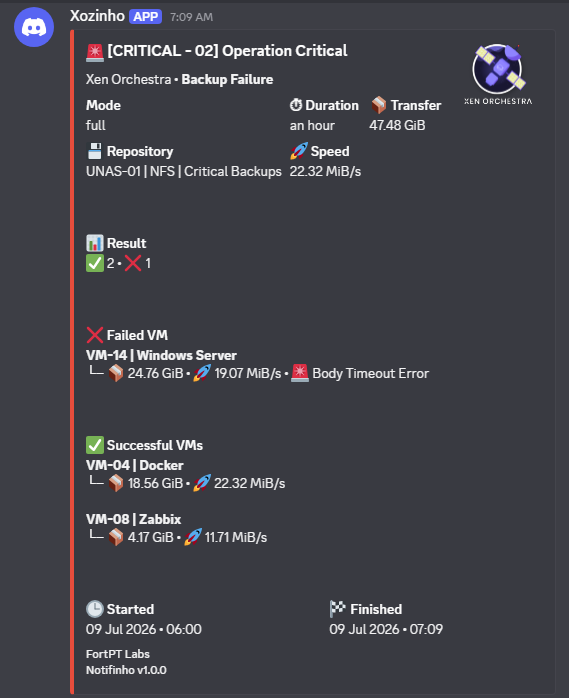
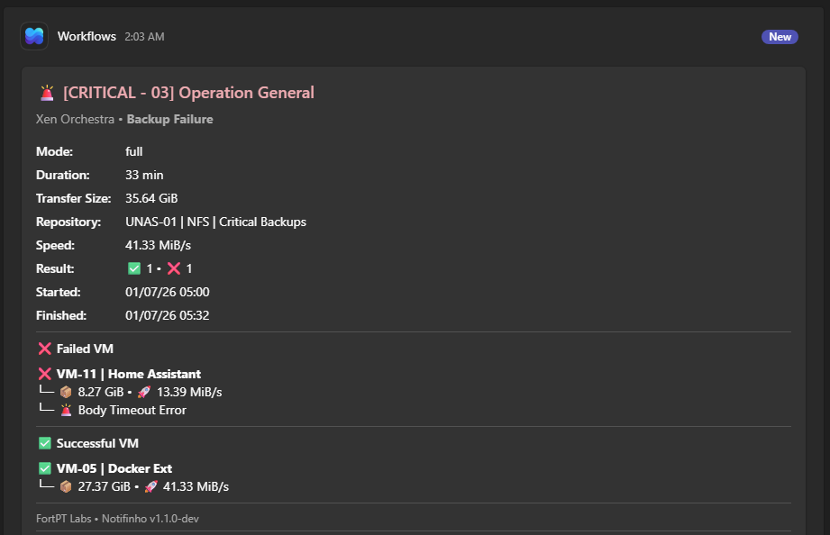

<p align="center">
  
</p>

<h1 align="center">Notifinho</h1>

<p align="center">
  <strong>Infrastructure Notification Engine</strong>
</p>

<p align="center">
Built for Homelabs • Ready for Enterprise
</p>

<p align="center">

<a href="https://github.com/FortPT/notifinho/releases">
  
</a>

<a href="https://www.python.org/">
  
</a>


</p>

---

# 🚀 Project Status

| Property | Value |
|----------|-------|
| **Status** | 🚀 Stable – Production Ready |
| **Current Stable Release** | **v1.0.1** |
| **Current Stable Release** | **v1.1.1** |
| **Development Version** | **v1.2.0-dev** |
| **License** | MIT |
| **Python** | 3.13 |

Notifinho is under active development. New parsers, notification platforms and integrations are planned while maintaining backwards compatibility whenever possible.

---

# 📸 Preview

> **Xen Orchestra → Discord**



*Example of a Xen Orchestra backup report transformed into a rich Discord notification by Notifinho.*

> **Xen Orchestra → Microsoft Teams**



*Example of the same Xen Orchestra backup report delivered as a Microsoft Teams Adaptive Card.*

---

# What is Notifinho?

**Notifinho** is a parser-driven Infrastructure Notification Engine that transforms traditional infrastructure email alerts into rich, structured notifications for modern collaboration platforms.

Instead of reading long HTML emails generated by infrastructure products, administrators receive clean, actionable notifications containing exactly the information they need, directly in Discord or Microsoft Teams.

Notifinho works alongside your existing infrastructure without requiring changes to the monitored software. If a product can send email, Notifinho can receive it, understand it, and deliver a significantly better notification experience.

Its modular architecture separates parsers, notification models, formatters and outputs, making it easy to support additional infrastructure platforms and messaging services over time.

---

# 🇵🇹 Why the name?

**Notifinho** comes from the Portuguese word **"notificação"** (notification).

The suffix **"-inho"** is commonly used in Portuguese to express something small, concise or simplified.

The idea behind the name reflects the project's purpose:

Instead of overwhelming administrators with long HTML emails, Notifinho delivers **small, clean and meaningful notifications** that can be understood in just a few seconds.

Simple.

Readable.

Actionable.

---

## 📑 Contents

- [What is Notifinho?](#what-is-notifinho)
- [Why Notifinho?](#why-notifinho)
- [Features](#features)
- [Supported Integrations](#supported-integrations)
- [Screenshots](#screenshots)
- [Project Goals](#project-goals)
- [Core Concepts](#core-concepts)
- [Architecture](#architecture)
- [Design Principles](#design-principles)
- [Quick Start](#quick-start)
- [Configuration](#configuration)
- [Example Flow](#example-flow)
- [Roadmap](#roadmap)
- [Contributing](#contributing)
- [License](#license)

---

# Why Notifinho?

Most infrastructure platforms still rely on HTML emails to report important events.

While these emails contain valuable information, they are often difficult to read, especially on mobile devices, and require administrators to search through large amounts of text to identify what really matters.

Notifinho solves this problem by parsing those emails and presenting the information in a clean, structured and consistent format designed for modern collaboration platforms.

Instead of replacing your monitoring software, Notifinho enhances it.

---

## Traditional Email vs. Notifinho

| Traditional Email | Notifinho |
|-------------------|------------|
| Long HTML emails | Rich notification cards |
| Difficult to read on mobile | Mobile-friendly layout |
| Important data buried in text | Critical information highlighted |
| Generic formatting | Product-specific formatting |
| Email only | Discord and Microsoft Teams |
| Limited visual feedback | Status colors, icons and structured sections |

---

# ✨ Features

## 📨 SMTP Gateway

- Native SMTP server
- Automatic email reception
- Parser-based architecture
- Configurable routing
- Product detection based on email content
- Zero changes required to monitored software

---

## 🎨 Rich Notifications

- Beautiful Discord embeds
- Microsoft Teams Adaptive Cards
- Mobile-friendly layouts
- Severity color coding
- Structured information blocks
- Consistent formatting across integrations

---

## 💾 Xen Orchestra

Current implementation includes:

- Backup status
- Backup mode
- Start and finish times
- Duration
- Repository
- Transfer size
- Transfer speed
- Success, failure and skipped counters
- VM-level backup results
- VM transfer size
- VM transfer speed
- VM-specific failure reasons
- Optional Job ID and Run ID
- Compact operator-friendly layout

---

## ⚡ Designed for Fast Decision Making

Every notification is designed around one principle:

> **Show the right information at the right time, in the clearest possible way.**

Rather than reproducing the original email, Notifinho extracts the relevant information, removes unnecessary noise and presents the result in a format optimized for fast decision making.

---

# 🔌 Supported Integrations

Notifinho is built around two independent concepts:

- **Sources** — Products that generate SMTP email notifications.
- **Destinations** — Platforms where those notifications are delivered.

This separation allows new infrastructure products and new messaging platforms to be added independently.

## 📥 Sources

| Product | Status |
|----------|:------:|
| Xen Orchestra | ✅ Stable |
| Zabbix | 📅 Planned |
| TrueNAS | 📅 Planned |
| UniFi | 📅 Planned |
| Proxmox VE | 📅 Planned |
| Generic SMTP | 📅 Planned |

## 📤 Destinations

| Platform | Status |
|-----------|:------:|
| Discord | ✅ Stable |
| Microsoft Teams | ✅ v1.1.1 |
| Slack | 📅 Planned |
| Telegram | 📅 Planned |
| Email | 📅 Planned |
| Webhook | 📅 Planned |

---

# 📸 Screenshots

## Xen Orchestra → Discord

The current implementation transforms Xen Orchestra backup reports into rich Discord notifications containing:

- Backup status
- Repository
- Transfer speed
- Transfer size
- Backup duration
- VM-level results
- Failure reasons
- Rich formatting with severity colors


---

# 🎯 Project Goals

Notifinho was created with a few simple goals in mind:

- Modernize infrastructure notifications.
- Preserve compatibility with existing SMTP-based products.
- Minimize configuration effort.
- Present important information that can be understood in seconds.
- Keep integrations modular and easy to extend.
- Support multiple notification platforms from a single notification model.

Rather than replacing existing monitoring or backup solutions, Notifinho complements them by improving how notifications are delivered.

---

# 🧩 Core Concepts

Notifinho is built around four simple concepts.

Understanding these concepts makes it easy to understand the entire project.

| Concept | Description |
|----------|-------------|
| **Parser** | Understands the email format of a specific product. |
| **Notification Model** | Converts parsed information into a common internal structure. |
| **Formatter** | Creates a platform-specific notification using the common notification model. |
| **Output** | Delivers the formatted notification to Discord, Microsoft Teams or future integrations. |

Because these components are independent, adding a new parser does not require changing existing formatters, and adding a new destination does not require modifying existing parsers.

---

# 🏗️ Architecture

```text
                     SMTP Email
                          │
                          ▼
              ┌───────────────────────┐
              │      Notifinho        │
              │                       │
              │  Parser Dispatcher    │
              └───────────┬───────────┘
                          │
        ┌─────────────────┼─────────────────┐
        ▼                 ▼                 ▼
 Xen Orchestra        Zabbix         Generic SMTP
     Parser            Parser            Parser
        │                 │                 │
        └─────────────────┼─────────────────┘
                          ▼
               Notification Model
                          │
          ┌───────────────┴───────────────┐
          ▼                               ▼
      Formatters                       Outputs
       
          │                               │
  ┌───────┼────────┐             ┌────────┼────────┐
  ▼       ▼        ▼             ▼        ▼        ▼
Discord  Teams   Slack        Discord   Teams   Webhook
```

One notification model.

Multiple parsers.

Multiple outputs.

Each layer has a single responsibility, making the project easy to understand, maintain and extend.

---

# ⚡ Design Principles

Every design decision in Notifinho follows a few core principles.

### 📖 Readability First

Important information should be visible within seconds.

Operators should never need to read an entire HTML email to understand what happened.

---

### 🔌 Zero Changes to Existing Software

If a product can send SMTP email, it can work with Notifinho.

Existing infrastructure does not need to be modified.

---

### 🧩 Parser-Driven Architecture

Each supported product has its own dedicated parser.

Adding support for a new platform should not impact existing integrations.

---

### 🎨 Output Independence

Parsers know nothing about Discord.

Formatters know nothing about Xen Orchestra.

This separation keeps every component focused on a single responsibility.

---

### 🚀 Built to Grow

Notifinho was designed from the beginning to support additional infrastructure platforms and messaging services without requiring architectural changes.

Today's implementation focuses on Xen Orchestra and Discord.

Tomorrow it may include Zabbix, TrueNAS, UniFi, Microsoft Teams, Slack, Telegram and many others.

---

# 🚀 Quick Start

Deploying Notifinho only takes a few minutes.

## Requirements

- Docker Engine 24+
- Docker Compose
- SMTP-capable application (Xen Orchestra, Zabbix, etc.)
- A Discord webhook and/or Microsoft Teams workflow webhook

---

## Docker Images

Notifinho images are available from both Docker Hub and GitHub Container Registry.

> **Note**
>
> Docker Hub and GitHub Container Registry images are built from the same source code and released simultaneously.

### Docker Hub

```bash
docker pull fortpt/notifinho:latest
```

### GitHub Container Registry

```bash
docker pull ghcr.io/fortpt/notifinho:latest
```

---

## 1. Clone the repository

```bash
git clone https://github.com/FortPT/notifinho.git

cd notifinho
```

---

## 2. Create your configuration

Copy the example configuration:

```bash
cp config/config.example.yaml config/config.yaml
```

Edit the configuration file:

```bash
nano config/config.yaml
```

Configure your Discord webhook:

```yaml
outputs:

  discord:

    enabled: true

    default:

      webhook: "https://discord.com/api/webhooks/YOUR_WEBHOOK"
```

---

## 3. Deploy with Docker Compose

Create a `docker-compose.yml` file:

```yaml
services:

  notifinho:

    image: fortpt/notifinho:latest

    container_name: notifinho

    restart: unless-stopped

    ports:
      - "8025:8025"

    volumes:
      - ./config:/notifinho/config
      - ./logs:/notifinho/logs
```

```bash
docker compose up -d
```

> **Tip**
>
> Configuration files and logs are stored outside the container using bind mounts.
> This allows you to upgrade Notifinho by simply pulling the latest image and restarting the container without losing your configuration or logs.

Verify that the container is running:

```bash
docker ps
```

View the application logs:

```bash
docker logs -f notifinho
```

---

# ⚙️ Configuration

Notifinho is configured using a single YAML configuration file.

```text
config/config.yaml
```

The configuration is intentionally simple and organized into logical sections.

| Section | Description |
|----------|-------------|
| `application` | General application settings. |
| `logging` | Log level and log file location. |
| `smtp` | SMTP listener configuration. |
| `routing` | Maps notification sources to outputs. |
| `outputs` | Notification destinations (Discord, Teams, etc.). |
| `notifications` | Product-specific notification preferences. |

---

## Example Configuration

```yaml
application:
  debug: false

logging:
  level: INFO
  file: /notifinho/logs/notifinho.log

smtp:
  host: 0.0.0.0
  port: 8025

outputs:

  discord:

    enabled: true

    default:

      webhook: "https://discord.com/api/webhooks/CHANGE_ME"

routing:

  xo:
    output: discord
    target: default

notifications:

  xo:

    success: false

    skipped: true

    failure: true

    show_ids: false
```

---

## Routing

Routing determines where notifications are sent after they have been parsed.

For example:

```yaml
routing:

  xo:
    output: discord
    target: default

  zabbix:
    output: teams
    target: operations
```

This makes it possible to send notifications from different products to different collaboration platforms without modifying the monitored software.

---

## Logging

Application logs are stored in:

```text
/notifinho/logs/notifinho.log
```

Incoming SMTP emails are optionally stored in:

```text
/notifinho/logs/emails/
```

These files are intended for troubleshooting and are ignored by Git.

---

# 📬 SMTP Configuration

By default, Notifinho listens on:

| Setting | Value |
|----------|-------|
| Host | `0.0.0.0` |
| Port | `8025` |

Most infrastructure products only require four SMTP settings:

| Setting | Value |
|----------|-------|
| SMTP Server | Notifinho host |
| Port | 8025 |
| Authentication | Disabled |
| TLS | Disabled |

Notifinho identifies the notification type using the email content rather than the recipient address, allowing existing SMTP configurations to be reused without modification.

---

# 🔄 Example Flow

The following example illustrates how a Xen Orchestra backup report is processed by Notifinho.

```text
                Xen Orchestra
                      │
               Backup Report Email
                      │
                      ▼
               SMTP (Port 8025)
                      │
                      ▼
                Notifinho
                      │
                      ▼
                 XO Parser
                      │
                      ▼
            Notification Model
                      │
                      ▼
             Discord Formatter
                      │
                      ▼
          Discord Rich Notification
```

Every supported integration follows the same architecture.

Only the parser changes.

Only the formatter changes.

The notification model remains the same.

This architecture allows Notifinho to grow without increasing complexity.

---

# 🗺️ Roadmap

The roadmap reflects the planned evolution of the project.

## ✅ v1.0.0

- Xen Orchestra parser
- Discord notifications
- SMTP gateway
- Docker deployment
- Parser-driven architecture
- Rich notification formatting
- Docker Hub release
- GitHub Container Registry

---

## ✅ v1.1.1

- Microsoft Teams output
- GitHub Actions
- Automatic image publishing

---

## 📅 v1.2.0

- Zabbix parser
- Rich Zabbix notifications
- Trigger-aware formatting
- Host-aware layouts

---

## 📅 v1.3.0

- TrueNAS parser
- Storage alerts
- Pool status
- Replication reports

---

## 📅 v1.4.0

- UniFi parser
- Network notifications
- Device alerts

---

## 🔮 v2.0.0

A major milestone focused on turning Notifinho into a complete notification platform.

Planned features include:

- Web administration interface
- Notification history
- Multi-user support
- Multiple routing profiles
- Notification templates
- Additional collaboration platforms
- REST API

---

# 🤝 Contributing

Contributions are welcome.

Whether you're fixing a typo, adding a parser or implementing a new output platform, every contribution helps improve the project.

If you'd like to contribute:

1. Fork the repository.
2. Create a feature branch.
3. Commit your changes.
4. Open a Pull Request.

Please keep pull requests focused and include a clear description of the changes.

---

# 📄 License

Notifinho is released under the MIT License.

See the [LICENSE](LICENSE) file for details.

---

# ❤️ Acknowledgements

Special thanks to the open-source community and the projects that inspired Notifinho.

In particular:

- Xen Orchestra
- Discord
- Docker
- Python
- BeautifulSoup
- aiosmtpd

---

──────────────────────────────────────────────

# ⚡ Powered by FortPT

Copyright © 2026 FortPT
